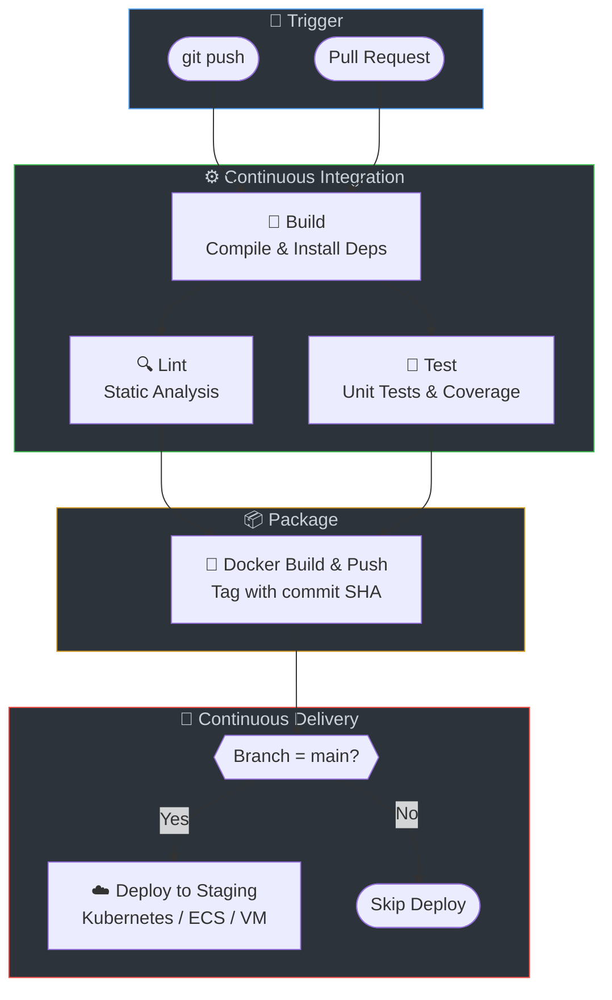

# 🚀 DevOps CI/CD Pipeline Reference

<div align="center">


**A comprehensive collection of CI/CD pipeline configurations across 9 popular DevOps tools and 8 tech stacks.**

*Production-ready templates with build, lint, test, Docker, and deploy stages.*

[Jenkins](#jenkins) · [GitHub Actions](#github-actions) · [GitLab CI](#gitlab-ci) · [CircleCI](#circleci) · [Travis CI](#travis-ci) · [Azure DevOps](#azure-devops) · [Bitbucket Pipelines](#bitbucket-pipelines) · [ArgoCD](#argocd) · [AWS CodePipeline](#aws-codepipeline)

</div>

---

## 📋 Coverage Matrix

| Tech Stack | Jenkins | GitHub Actions | GitLab CI | CircleCI | Travis CI | Azure DevOps | Bitbucket | ArgoCD | AWS CodePipeline |
|:----------:|:-------:|:--------------:|:---------:|:--------:|:---------:|:------------:|:---------:|:------:|:----------------:|
| ☕ Java     | ✅ | ✅ | ✅ | ✅ | ✅ | ✅ | ✅ | ✅ | ✅ |
| 🟢 Node.js | ✅ | ✅ | ✅ | ✅ | ✅ | ✅ | ✅ | ✅ | ✅ |
| 🐍 Python  | ✅ | ✅ | ✅ | ✅ | ✅ | ✅ | ✅ | ✅ | ✅ |
| 🔵 Go      | ✅ | ✅ | ✅ | ✅ | ✅ | ✅ | ✅ | ✅ | ✅ |
| 🟣 .NET    | ✅ | ✅ | ✅ | ✅ | ✅ | ✅ | ✅ | ✅ | ✅ |
| 💎 Ruby    | ✅ | ✅ | ✅ | ✅ | ✅ | ✅ | ✅ | ✅ | ✅ |
| 🦀 Rust    | ✅ | ✅ | ✅ | ✅ | ✅ | ✅ | ✅ | ✅ | ✅ |
| 🐘 PHP     | ✅ | ✅ | ✅ | ✅ | ✅ | ✅ | ✅ | ✅ | ✅ |

---

## 📂 Repository Structure

```
├── sample-apps/              # Minimal app stubs per tech stack
│   ├── java/
│   ├── nodejs/
│   ├── python/
│   ├── go/
│   ├── dotnet/
│   ├── ruby/
│   ├── rust/
│   └── php/
│
├── jenkins/                  # Declarative Jenkinsfiles
├── github-actions/           # GitHub Actions YAML workflows
├── gitlab-ci/                # GitLab CI/CD YAML configs
├── circleci/                 # CircleCI config.yml files
├── travis-ci/                # Travis CI .travis.yml files
├── azure-devops/             # Azure Pipelines YAML
├── bitbucket-pipelines/      # Bitbucket pipeline configs
├── argocd/                   # ArgoCD Application manifests
└── aws-codepipeline/         # AWS CodeBuild buildspec files
```

---

## 🔄 Pipeline Stages

Every pipeline follows a consistent **5-stage pattern**:



| Stage    | Description                                     |
|----------|-------------------------------------------------|
| **Build**   | Compile source code / install dependencies     |
| **Lint**    | Static code analysis & style checks            |
| **Test**    | Run unit tests with coverage reports           |
| **Docker**  | Build & push Docker image                      |
| **Deploy**  | Deploy to staging environment                  |

---

## 🛠️ Tool Comparison

| Tool | Hosting | Best For | Key Features |
|------|---------|----------|--------------|
| **Jenkins** | Self-hosted or cloud | Enterprises, flexibility | Plugins, declarative pipelines, Docker agents |
| **GitHub Actions** | SaaS (GitHub) | GitHub repos | Native integration, free for public repos, matrix builds |
| **GitLab CI** | Self-hosted or GitLab.com | GitLab repos | Built-in registry, Docker-in-Docker, environments |
| **CircleCI** | SaaS | Cloud-native teams | Orbs, remote Docker, parallelism |
| **Travis CI** | SaaS | Open source | Simple config, GitHub integration |
| **Azure DevOps** | SaaS (Microsoft) | Microsoft ecosystem | Approval gates, variable groups, service connections |
| **Bitbucket Pipelines** | SaaS (Atlassian) | Bitbucket repos | Integrated with Jira, deployment environments |
| **ArgoCD** | Self-hosted (K8s) | GitOps, Kubernetes | Declarative sync, multi-cluster, rollbacks |
| **AWS CodePipeline** | SaaS (AWS) | AWS workloads | ECR, ECS, Lambda, CloudFormation integration |

---

## 🛠️ Tools Overview

### Jenkins
Industry-standard automation server with declarative pipeline syntax. Each tech stack has a `Jenkinsfile` with Docker agent, stages, and post-build actions.

### GitHub Actions
GitHub-native CI/CD with YAML workflows. Includes caching, matrix builds, and artifact uploads.

### GitLab CI
GitLab-integrated pipelines with `.gitlab-ci.yml`. Features Docker-in-Docker, artifacts, and environment deployments.

### CircleCI
Cloud-native CI/CD with orbs, executors, and workflow orchestration.

### Travis CI
Simple CI/CD with `.travis.yml` configuration. Great for open-source projects.

### Azure DevOps
Microsoft's DevOps platform with `azure-pipelines.yml`. Supports multi-stage pipelines with approval gates.

### Bitbucket Pipelines
Atlassian's integrated CI/CD with `bitbucket-pipelines.yml`. Built-in Docker support and deployment environments.

### ArgoCD
Declarative GitOps continuous delivery for Kubernetes. Application manifests that sync with Git repositories.

### AWS CodePipeline
AWS-native CI/CD with CodeBuild `buildspec.yml`. Integrates with ECR, ECS, Lambda, and other AWS services.

---

## 🚀 Quick Start

1. **Clone the repository:**
   ```bash
   git clone https://github.com/22taran/devops-ci-cd-templates.git
   cd devops-ci-cd-templates
   ```

2. **Choose a tool and tech stack:**
   Navigate to the desired tool folder and tech stack subfolder.

3. **Copy the pipeline config** into your project and customize:
   - Update project-specific values (repo URL, Docker registry, etc.)
   - Adjust deployment targets and environment variables
   - Modify test and build commands as needed

4. **Reference the sample apps** in `sample-apps/` for the expected project structure.

---

## 🔧 Troubleshooting

| Issue | Possible Cause | Solution |
|-------|----------------|----------|
| **Docker login failed** | Invalid credentials or wrong registry URL | Verify `DOCKER_USERNAME`, `DOCKER_PASSWORD` (or equivalent) in CI secrets. Use `docker login` locally to test. |
| **Build timeout** | Slow dependency download or large project | Increase timeout in pipeline options. Enable caching (Maven `.m2`, npm, pip). |
| **Out of memory** | Default runner memory too low | Use larger runners, split jobs, or reduce parallelism. |
| **Lint/test fails locally but passes in CI** | Different versions or env | Pin versions in config (e.g., `package-lock.json`, `requirements.txt`). Use same Docker image locally. |
| **Deploy stage skipped** | Branch filter | Deploy typically runs only on `main`. Push to main or adjust the `when`/`only`/`filters` condition. |
| **ArgoCD out of sync** | Image tag mismatch or Git path wrong | Ensure CI pushes to the same image tag ArgoCD expects. Verify `repoURL` and `path` in Application manifest. |

---

## 📚 Resources

| Tool | Official Docs |
|------|---------------|
| Jenkins | [jenkins.io/doc](https://www.jenkins.io/doc/) |
| GitHub Actions | [docs.github.com/actions](https://docs.github.com/en/actions) |
| GitLab CI | [docs.gitlab.com/ee/ci](https://docs.gitlab.com/ee/ci/) |
| CircleCI | [circleci.com/docs](https://circleci.com/docs/) |
| Travis CI | [docs.travis-ci.com](https://docs.travis-ci.com/) |
| Azure DevOps | [learn.microsoft.com](https://learn.microsoft.com/en-us/azure/devops/pipelines/) |
| Bitbucket | [support.atlassian.com](https://support.atlassian.com/bitbucket-cloud/docs/get-started-with-bitbucket-pipelines/) |
| ArgoCD | [argo-cd.readthedocs.io](https://argo-cd.readthedocs.io/) |
| AWS CodePipeline | [docs.aws.amazon.com](https://docs.aws.amazon.com/codepipeline/) |

---

## 🤝 Contributing

Contributions are welcome! Please read the [CONTRIBUTING.md](CONTRIBUTING.md) for guidelines.

## 📄 License

This project is licensed under the MIT License — see the [LICENSE](LICENSE) file for details.

---

<div align="center">

**⭐ Star this repo if you find it useful!**

Made with ❤️ for the DevOps community

</div>
