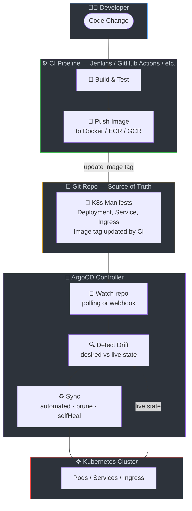

# 🔄 ArgoCD Application Manifests

ArgoCD GitOps application configurations for 8 tech stacks.

## Prerequisites

- Kubernetes cluster with ArgoCD installed
- Container registry with built images (from CI)
- Git repository accessible by ArgoCD

## What is ArgoCD?

ArgoCD is a declarative, GitOps continuous delivery tool for Kubernetes. It monitors Git repositories for changes and automatically syncs the desired state to the cluster. CI builds and pushes images; ArgoCD deploys the manifests.

## CI/CD + GitOps Flow

## Stage-by-Stage Explanation

| Component | Purpose | What Happens |
|-----------|---------|--------------|
| **Application** | ArgoCD Application CR | Points to Git repo path (e.g., argocd/java/k8s), target cluster, namespace |
| **source** | Git source | repoURL, targetRevision (branch/tag), path to K8s manifests |
| **destination** | Deployment target | server (cluster), namespace |
| **syncPolicy** | Sync behavior | automated sync, prune, selfHeal, retry |
| **Deployment** | K8s Deployment | Image, replicas, probes, resources |

## Tech Stacks

| Stack | File | K8s Path | Image |
|-------|------|----------|-------|
| Java | [java/application.yaml](java/application.yaml) | argocd/java/k8s | myregistry/java-app |
| Node.js | [nodejs/application.yaml](nodejs/application.yaml) | argocd/nodejs/k8s | myregistry/nodejs-app |
| Python | [python/application.yaml](python/application.yaml) | argocd/python/k8s | myregistry/python-app |
| Go | [go/application.yaml](go/application.yaml) | argocd/go/k8s | myregistry/go-app |
| .NET | [dotnet/application.yaml](dotnet/application.yaml) | argocd/dotnet/k8s | myregistry/dotnet-app |
| Ruby | [ruby/application.yaml](ruby/application.yaml) | argocd/ruby/k8s | myregistry/ruby-app |
| Rust | [rust/application.yaml](rust/application.yaml) | argocd/rust/k8s | myregistry/rust-app |
| PHP | [php/application.yaml](php/application.yaml) | argocd/php/k8s | myregistry/php-app |

## Usage

1. Install ArgoCD in your cluster: `kubectl apply -n argocd -f https://raw.githubusercontent.com/argoproj/argo-cd/stable/manifests/install.yaml`
2. Apply the desired `application.yaml`: `kubectl apply -f application.yaml`
3. Update `repoURL` and `targetRevision` in the manifest to point to your repo
4. Update the image in the Deployment to your registry

## Resources

- [ArgoCD Documentation](https://argo-cd.readthedocs.io/)
- [ArgoCD Getting Started](https://argo-cd.readthedocs.io/en/stable/getting_started/)
