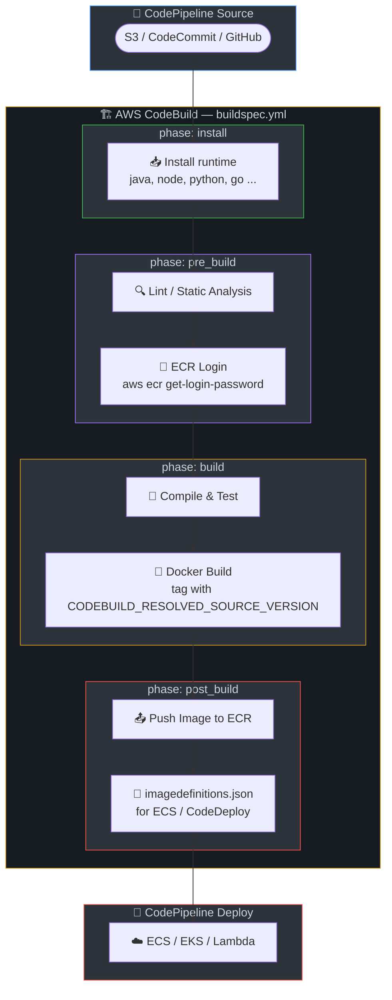

# ☁️ AWS CodePipeline / CodeBuild

AWS CodeBuild buildspec configurations for 8 tech stacks.

## Prerequisites

- AWS Account with CodePipeline and CodeBuild
- ECR repository for Docker images
- IAM roles with appropriate permissions
- S3 bucket for artifacts (auto-created by CodePipeline)

## Pipeline Structure

Each `buildspec.yml` defines CodeBuild phases:
- **install**: Set up runtime (Java, Node, Python, etc.)
- **pre_build**: Lint, ECR login
- **build**: Compile, test, Docker build
- **post_build**: Push image, create imagedefinitions.json for ECS/CodeDeploy

## CI/CD Pipeline Diagram

## Phase-by-Phase Explanation

| Phase | Purpose | What Happens | Artifacts / Output |
|-------|---------|--------------|--------------------|
| **install** | Runtime setup | runtime-versions (java, nodejs, etc.) | — |
| **pre_build** | Lint + auth | checkstyle, ESLint, etc. ECR login. | — |
| **build** | Compile, test, Docker | Maven/npm/dotnet build, test, docker build | — |
| **post_build** | Push and artifacts | docker push, imagedefinitions.json | imagedefinitions.json, JAR |
| **artifacts** | Output | imagedefinitions.json for ECS, JAR for Lambda | — |
| **reports** | Test reports | JUnit XML for CodeBuild test reports | — |

## Tech Stacks

| Stack | File | Runtime | Lint Tool | Test Framework |
|-------|------|---------|-----------|----------------|
| Java | [java/buildspec.yml](java/buildspec.yml) | corretto17 | Checkstyle | JUnit |
| Node.js | [nodejs/buildspec.yml](nodejs/buildspec.yml) | nodejs 18 | ESLint | Jest/npm test |
| Python | [python/buildspec.yml](python/buildspec.yml) | python 3.12 | flake8 | pytest |
| Go | [go/buildspec.yml](go/buildspec.yml) | golang 1.21 | go vet | go test |
| .NET | [dotnet/buildspec.yml](dotnet/buildspec.yml) | dotnet 8.0 | dotnet format | xUnit/NUnit |
| Ruby | [ruby/buildspec.yml](ruby/buildspec.yml) | ruby 3.3 | RuboCop | RSpec |
| Rust | [rust/buildspec.yml](rust/buildspec.yml) | rust 1.73 | clippy, rustfmt | cargo test |
| PHP | [php/buildspec.yml](php/buildspec.yml) | php 8.2 | phpcs, phpstan | PHPUnit |

## Usage

1. Create a CodePipeline in AWS Console or via CloudFormation
2. Add CodeBuild as a build stage
3. Place `buildspec.yml` in your project root
4. Configure environment variables in CodeBuild project (ECR_REPO, etc.)
5. Create ECR repository and update ECR_REPO in buildspec

## Resources

- [AWS CodePipeline Documentation](https://docs.aws.amazon.com/codepipeline/)
- [CodeBuild Buildspec Reference](https://docs.aws.amazon.com/codebuild/latest/userguide/build-spec-ref.html)
