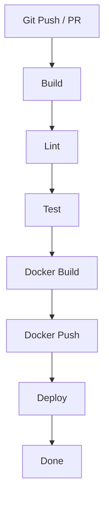

# ☁️ Azure DevOps Pipelines

Azure Pipelines YAML configurations for 8 tech stacks.

## Prerequisites

- Azure DevOps organization and project
- Service connections: Docker Registry, Kubernetes (optional)
- Pipeline variables or variable groups configured

## Pipeline Structure

Each `azure-pipelines.yml` uses multi-stage pipelines with:
- **Stages**: Build → Lint → Test → Docker → Deploy
- **Tasks**: Maven, Node, Python, DotNet, etc.
- **Artifacts**: publish between stages
- **Approval gates**: Optional for deploy stage

## CI/CD Pipeline Diagram

## Stage-by-Stage Explanation

| Stage | Purpose | What Happens | Artifacts / Output |
|-------|---------|--------------|--------------------|
| **Build** | Compile or install deps | Maven, npm, dotnet, etc. publish artifact. | java-build, publish/ |
| **Lint** | Static analysis | checkstyle, ESLint, flake8, etc. Fails on violations. | — |
| **Test** | Unit tests + coverage | Runs tests, publishJUnitResults, JaCoCo/Cobertura. | Test results |
| **Docker** | Build and push image | Docker task build + push. Runs on every branch. | Image in registry |
| **Deploy** | Deploy to staging | Runs on every branch. Supports Docker or Kubernetes. Replace with kubectl/Helm/docker run. | — |

## Tech Stacks

| Stack | File | VM Image | Lint Tool | Test Framework |
|-------|------|----------|-----------|----------------|
| Java | [java/azure-pipelines.yml](java/azure-pipelines.yml) | ubuntu-latest | Checkstyle | JUnit/JaCoCo |
| Node.js | [nodejs/azure-pipelines.yml](nodejs/azure-pipelines.yml) | ubuntu-latest | ESLint | Jest/npm test |
| Python | [python/azure-pipelines.yml](python/azure-pipelines.yml) | ubuntu-latest | flake8 | pytest |
| Go | [go/azure-pipelines.yml](go/azure-pipelines.yml) | ubuntu-latest | go vet | go test |
| .NET | [dotnet/azure-pipelines.yml](dotnet/azure-pipelines.yml) | ubuntu-latest | dotnet format | xUnit/NUnit |
| Ruby | [ruby/azure-pipelines.yml](ruby/azure-pipelines.yml) | ubuntu-latest | RuboCop | RSpec |
| Rust | [rust/azure-pipelines.yml](rust/azure-pipelines.yml) | ubuntu-latest | clippy, rustfmt | cargo test |
| PHP | [php/azure-pipelines.yml](php/azure-pipelines.yml) | ubuntu-latest | phpcs, phpstan | PHPUnit |

## Usage

1. Copy `azure-pipelines.yml` to your project root
2. Create pipeline in Azure DevOps pointing to the YAML file
3. Configure service connections and variables
4. Run the pipeline

## Resources

- [Azure Pipelines YAML Schema](https://learn.microsoft.com/en-us/azure/devops/pipelines/yaml-schema/)
