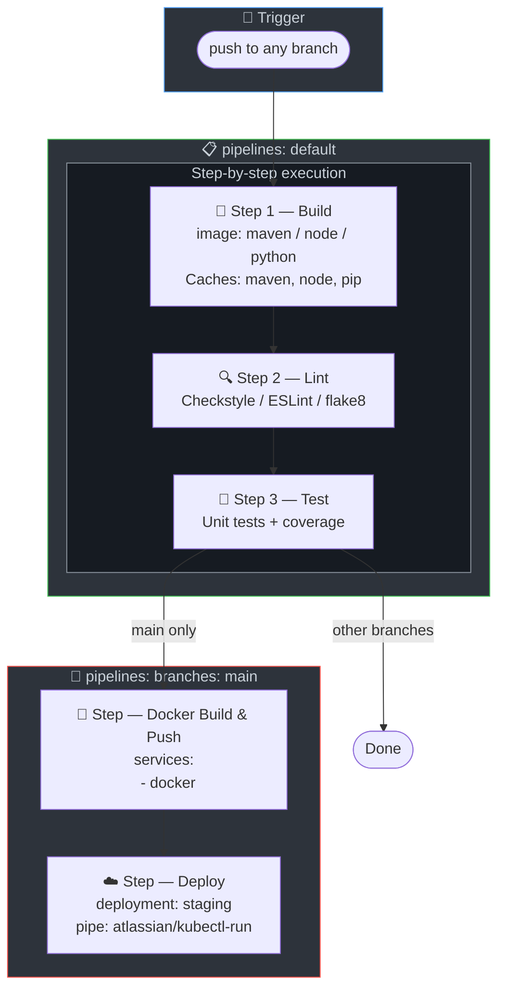

# 🪣 Bitbucket Pipelines

Bitbucket Pipelines configurations for 8 tech stacks.

## Prerequisites

- Bitbucket Cloud repository
- Repository variables: `DOCKER_USERNAME`, `DOCKER_PASSWORD`
- Deployment environments configured (optional)

## Pipeline Structure

Each `bitbucket-pipelines.yml` uses Bitbucket's native syntax with:
- **Steps**: Sequential steps with caches and artifacts
- **Branches**: `default` for PRs, `main` for full pipeline including Docker and deploy
- **Deployment**: `deployment: staging` for environment tracking

## CI/CD Pipeline Diagram

## Stage-by-Stage Explanation

| Step | Purpose | What Happens | Artifacts / Output |
|------|---------|--------------|--------------------|
| **Build** | Compile or install deps | Maven, npm, pip, etc. Uses caches. | target/*.jar, node_modules |
| **Lint** | Static analysis | checkstyle, ESLint, flake8, etc. Fails on violations. | — |
| **Test** | Unit tests | Runs tests. Some configs store coverage. | — |
| **Docker Build & Push** | Containerize and push | Only on main. Docker build, login, push. | Image in registry |
| **Deploy** | Deploy to staging | Only on main. deployment: staging. Replace with kubectl/Helm. | — |

## Tech Stacks

| Stack | File | Image | Lint Tool | Test Framework |
|-------|------|-------|-----------|----------------|
| Java | [java/bitbucket-pipelines.yml](java/bitbucket-pipelines.yml) | maven:3.9-eclipse-temurin-17 | Checkstyle | JUnit |
| Node.js | [nodejs/bitbucket-pipelines.yml](nodejs/bitbucket-pipelines.yml) | node:18-alpine | ESLint | Jest/npm test |
| Python | [python/bitbucket-pipelines.yml](python/bitbucket-pipelines.yml) | python:3.12-slim | flake8 | pytest |
| Go | [go/bitbucket-pipelines.yml](go/bitbucket-pipelines.yml) | golang:1.21-alpine | go vet | go test |
| .NET | [dotnet/bitbucket-pipelines.yml](dotnet/bitbucket-pipelines.yml) | mcr.microsoft.com/dotnet/sdk:8.0 | dotnet format | xUnit/NUnit |
| Ruby | [ruby/bitbucket-pipelines.yml](ruby/bitbucket-pipelines.yml) | ruby:3.3-slim | RuboCop | RSpec |
| Rust | [rust/bitbucket-pipelines.yml](rust/bitbucket-pipelines.yml) | rust:1.73-slim | clippy, rustfmt | cargo test |
| PHP | [php/bitbucket-pipelines.yml](php/bitbucket-pipelines.yml) | php:8.2-cli | phpcs, phpstan | PHPUnit |

## Usage

1. Copy `bitbucket-pipelines.yml` to your project root
2. Configure repository variables in Bitbucket: Repository settings → Pipelines → Repository variables
3. Push to trigger

## Resources

- [Bitbucket Pipelines Documentation](https://support.atlassian.com/bitbucket-cloud/docs/get-started-with-bitbucket-pipelines/)
