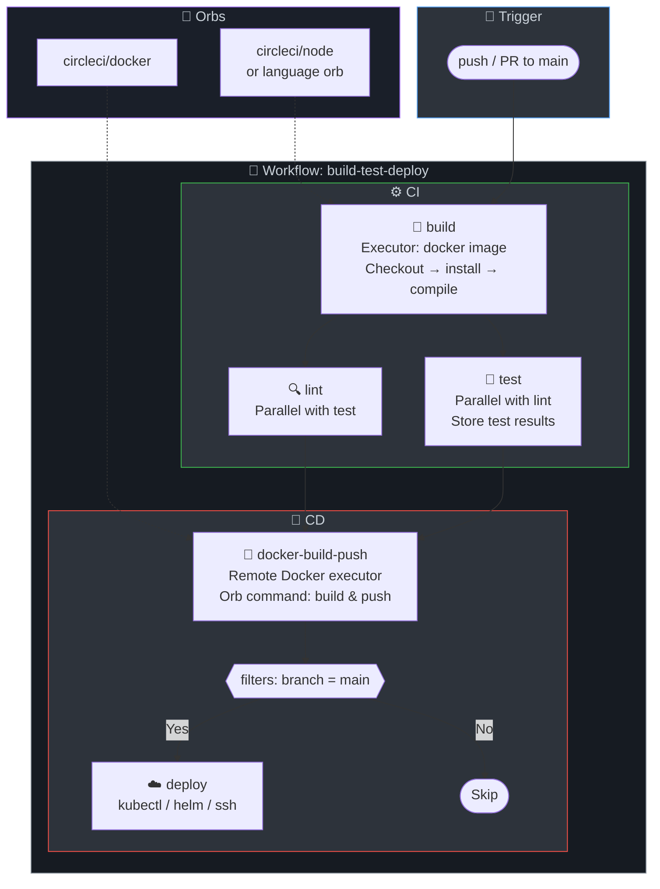

# ⚡ CircleCI Pipelines

CircleCI pipeline configurations for 8 tech stacks.

## Prerequisites

- CircleCI account connected to your VCS (GitHub, Bitbucket)
- Context or project-level env vars: `DOCKER_USERNAME`, `DOCKER_PASSWORD`

## Pipeline Structure

Each `config.yml` uses CircleCI 2.1 syntax with:
- **Executors**: Docker images per tech stack (cimg/openjdk, cimg/node, etc.)
- **Orbs**: Reusable packages (e.g., docker orb for build/push)
- **Workflows**: Job dependencies, branch filters
- **Caching**: restore_cache / save_cache for deps

## CI/CD Pipeline Diagram

## Stage-by-Stage Explanation

| Job | Purpose | What Happens | Artifacts / Output |
|-----|---------|--------------|--------------------|
| **build** | Compile or install deps | checkout, restore_cache, run build commands, save_cache, persist_to_workspace | Workspace: target/, node_modules, etc. |
| **lint** | Static analysis | restore_cache, run lint (checkstyle, eslint, etc.) | — |
| **test** | Unit tests + coverage | restore_cache, run tests, store_test_results, store_artifacts | JUnit XML, coverage reports |
| **docker-build** | Containerize and push | setup_remote_docker, docker orb build/push. Only on main. | Image in registry |
| **deploy** | Deploy to staging | Only on main. Replace echo with kubectl/Helm. | — |

## Tech Stacks

| Stack | File | Executor Image | Lint Tool | Test Framework |
|-------|------|---------------|-----------|----------------|
| Java | [java/config.yml](java/config.yml) | cimg/openjdk:17.0 | Checkstyle | JUnit/JaCoCo |
| Node.js | [nodejs/config.yml](nodejs/config.yml) | cimg/node:18.0 | ESLint | Jest/npm test |
| Python | [python/config.yml](python/config.yml) | cimg/python:3.12 | flake8 | pytest |
| Go | [go/config.yml](go/config.yml) | cimg/go:1.21 | go vet | go test |
| .NET | [dotnet/config.yml](dotnet/config.yml) | cimg/dotnet:8.0 | dotnet format | xUnit/NUnit |
| Ruby | [ruby/config.yml](ruby/config.yml) | cimg/ruby:3.3 | RuboCop | RSpec |
| Rust | [rust/config.yml](rust/config.yml) | cimg/rust:1.73 | clippy, rustfmt | cargo test |
| PHP | [php/config.yml](php/config.yml) | cimg/php:8.2 | phpcs, phpstan | PHPUnit |

## Usage

1. Copy the desired `config.yml` to `.circleci/config.yml` in your project
2. Connect your repo to CircleCI
3. Configure environment variables in CircleCI project settings (or use a Context)
4. Update `image` in docker/build and docker/push to your registry path

## Resources

- [CircleCI Documentation](https://circleci.com/docs/)
- [CircleCI Orbs Registry](https://circleci.com/developer/orbs)
