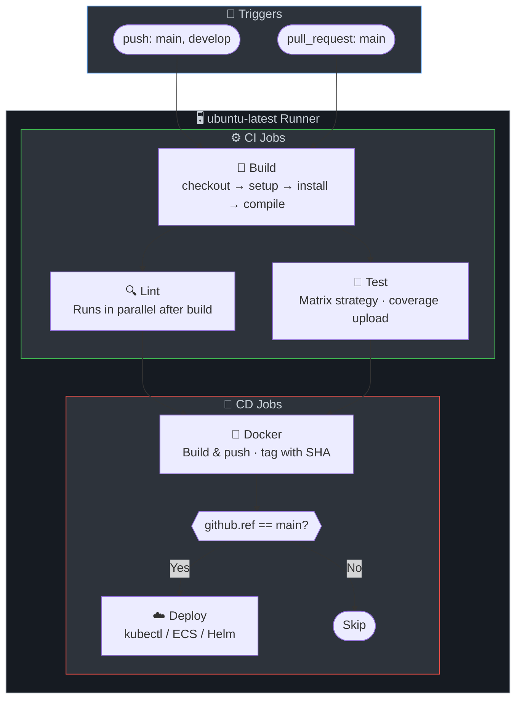

# 🐙 GitHub Actions Workflows

GitHub-native CI/CD workflow configurations for 8 tech stacks.

## Prerequisites

- GitHub repository with Actions enabled
- Repository secrets: `DOCKER_USERNAME`, `DOCKER_PASSWORD`
- Optional: `DEPLOY_TOKEN` for deployment

## Workflow Structure

Each `ci.yml` workflow includes:
- **Triggers**: Push to `main`/`develop`, pull requests to `main`
- **Caching**: Language-specific dependency caching (Maven, npm, pip, etc.)
- **5 jobs**: Build → Lint → Test → Docker → Deploy
- **Artifact uploads** for build outputs and coverage reports

## CI/CD Pipeline Diagram

## Stage-by-Stage Explanation

| Job | Purpose | What Happens | Artifacts / Output |
|-----|---------|--------------|--------------------|
| **Triggers** | When to run | `on.push` to main/develop, `on.pull_request` to main. Configurable per workflow. | — |
| **Build** | Compile or install deps | setup-node/java/python/etc, install deps, compile. Uses `actions/cache` or built-in cache. | Uploaded artifacts (JAR, node_modules cache key) |
| **Lint** | Static analysis | Runs in parallel with test. checkstyle, ESLint, flake8, go vet, etc. Fails workflow on violations. | — |
| **Test** | Unit tests + coverage | Runs tests, uploads coverage as artifact. Some workflows use matrix for multi-version testing. | coverage-report artifact |
| **Docker** | Containerize and push | Only on `main`. Docker Buildx, login, build-push with GHA cache. Tags: `sha` + `latest`. | Image in registry |
| **Deploy** | Deploy to staging | Only on `main`, after docker. Uses `environment: staging`. Replace with kubectl/Helm/etc. | — |

## Tech Stacks

| Stack | File | Runner | Lint Tool | Test Framework | Extra Jobs |
|-------|------|--------|-----------|----------------|------------|
| Java | [java/ci.yml](java/ci.yml) | `ubuntu-latest` + JDK 17 | Checkstyle | JUnit/JaCoCo | Package in build |
| Node.js | [nodejs/ci.yml](nodejs/ci.yml) | `ubuntu-latest` + Node 18 | ESLint | Jest/npm test | Matrix: Node 18,20,22 |
| Python | [python/ci.yml](python/ci.yml) | `ubuntu-latest` + Python 3.12 | flake8 | pytest | Install in build |
| Go | [go/ci.yml](go/ci.yml) | `ubuntu-latest` + Go 1.21 | go vet, staticcheck | go test | — |
| .NET | [dotnet/ci.yml](dotnet/ci.yml) | `ubuntu-latest` + .NET 8 | dotnet format | xUnit/NUnit | Restore, Publish |
| Ruby | [ruby/ci.yml](ruby/ci.yml) | `ubuntu-latest` + Ruby 3.3 | RuboCop | RSpec | Install in build |
| Rust | [rust/ci.yml](rust/ci.yml) | `ubuntu-latest` + Rust stable | clippy, rustfmt | cargo test | — |
| PHP | [php/ci.yml](php/ci.yml) | `ubuntu-latest` + PHP 8.2 | phpcs, phpstan | PHPUnit | Install in build |

## Usage

1. Copy the desired `ci.yml` to `.github/workflows/` in your repo (e.g., `ci.yml` or `java-ci.yml`)
2. Configure required secrets in GitHub repo settings: `DOCKER_USERNAME`, `DOCKER_PASSWORD`
3. Update `DOCKER_IMAGE` in the workflow to your registry path
4. Push to trigger the workflow

## Resources

- [GitHub Actions Documentation](https://docs.github.com/en/actions)
- [Workflow Syntax](https://docs.github.com/en/actions/using-workflows/workflow-syntax-for-github-actions)
