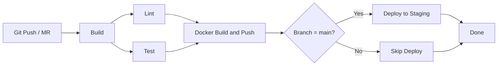

# 🦊 GitLab CI Pipelines

GitLab CI/CD pipeline configurations for 8 tech stacks.

## Prerequisites

- GitLab instance or GitLab.com account
- Container registry access for Docker builds
- CI/CD variables: `CI_REGISTRY`, `CI_REGISTRY_USER`, `CI_REGISTRY_PASSWORD`

## Pipeline Structure

Each `.gitlab-ci.yml` uses GitLab's native pipeline syntax with:
- **Stages**: build → lint → test → docker (build + push) → deploy
- **Docker images** per job for reproducible builds
- **Caching** for dependency speedup (Maven, npm, pip, etc.)
- **Artifacts** for build outputs and coverage reports

## CI/CD Pipeline Diagram

## Stage-by-Stage Explanation

| Stage | Purpose | What Happens | Artifacts / Output |
|-------|---------|--------------|--------------------|
| **build** | Compile or install deps | Uses Docker image per stack. Maven compile, npm ci, pip install, etc. Caches deps for speed. | JAR, node_modules, publish/ |
| **lint** | Static analysis | Runs in parallel with test. checkstyle, ESLint, flake8, go vet, etc. Fails on violations. | — |
| **test** | Unit tests + coverage | Runs tests. JUnit/Cobertura reports, coverage extraction. Artifacts expire after 7 days. | surefire-reports, jacoco, coverage |
| **docker** | Containerize and push | Docker-in-Docker (dind). Build then push with commit SHA + latest. Runs every branch. | Image in registry |
| **deploy** | Deploy to staging | Often `when: manual` for approval. Supports Docker or Kubernetes. Replace echo with kubectl/Helm. | — |

## Tech Stacks

| Stack | File | Docker Image | Lint Tool | Test Framework |
|-------|------|--------------|-----------|----------------|
| Java | [java/.gitlab-ci.yml](java/.gitlab-ci.yml) | maven:3.9-eclipse-temurin-17 | Checkstyle | JUnit/JaCoCo |
| Node.js | [nodejs/.gitlab-ci.yml](nodejs/.gitlab-ci.yml) | node:18-alpine | ESLint | Jest/npm test |
| Python | [python/.gitlab-ci.yml](python/.gitlab-ci.yml) | python:3.12-slim | flake8 | pytest |
| Go | [go/.gitlab-ci.yml](go/.gitlab-ci.yml) | golang:1.21-alpine | go vet | go test |
| .NET | [dotnet/.gitlab-ci.yml](dotnet/.gitlab-ci.yml) | mcr.microsoft.com/dotnet/sdk:8.0 | dotnet format | xUnit/NUnit |
| Ruby | [ruby/.gitlab-ci.yml](ruby/.gitlab-ci.yml) | ruby:3.3-slim | RuboCop | RSpec |
| Rust | [rust/.gitlab-ci.yml](rust/.gitlab-ci.yml) | rust:1.73-slim | clippy, rustfmt | cargo test |
| PHP | [php/.gitlab-ci.yml](php/.gitlab-ci.yml) | php:8.2-cli | phpcs, phpstan | PHPUnit |

## Usage

1. Copy the desired `.gitlab-ci.yml` to your project root
2. Update variables and Docker registry settings (use `CI_REGISTRY_IMAGE` for built-in registry)
3. Configure CI/CD variables in GitLab: Settings → CI/CD → Variables
4. Push to trigger the pipeline

## Resources

- [GitLab CI/CD Documentation](https://docs.gitlab.com/ee/ci/)
- [Pipeline Architecture](https://docs.gitlab.com/ee/ci/pipelines/pipeline_architectures.html)
