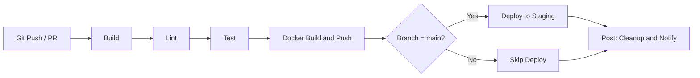

# ⚙️ Jenkins Pipelines

Declarative Jenkins pipeline configurations for 8 tech stacks.

## Prerequisites

- Jenkins 2.387+ with Pipeline plugin
- Docker Pipeline plugin (for Docker agents)
- Credentials configured: `docker-hub-credentials`, `deploy-credentials`

## Pipeline Structure

Each `Jenkinsfile` uses declarative pipeline syntax with:
- **Docker-based agents** for consistent builds
- **5 stages**: Build → Lint → Test → Docker → Deploy
- **Post-build actions** for cleanup and notifications
- **Environment variables** for configuration

## CI/CD Pipeline Diagram

## Stage-by-Stage Explanation

| Stage | Purpose | What Happens | Artifacts / Output |
|-------|---------|--------------|--------------------|
| **Agent** | Reproducible build environment | Jenkins spins up a Docker container with the tech stack's official image. Some stacks mount caches (e.g., Maven `.m2`) to speed up builds. | Clean, isolated workspace |
| **Environment** | Configuration | `DOCKER_IMAGE`, `DOCKER_TAG`, `DEPLOY_ENV` are set. Customize these for your registry and target environment. | Env vars available to all stages |
| **Options** | Pipeline behavior | Timeout (20–30 min), no concurrent builds, keep last 10 build logs. Prevents runaway jobs and clutter. | — |
| **Build / Install / Restore** | Compile or install deps | Maven compile, `npm ci`, `pip install`, `go build`, `dotnet restore/build`, `bundle install`, `cargo build`, `composer install`. | Compiled code or installed deps |
| **Lint** | Static analysis | checkstyle, ESLint, flake8, go vet/staticcheck, dotnet format, RuboCop, clippy/rustfmt, phpcs/phpstan. Fails build on style or quality violations. | — |
| **Test** | Unit tests + coverage | Run tests with coverage. Publish JUnit, Cobertura, or HTML reports to Jenkins. | Test reports, coverage data |
| **Package / Publish** | (Java, .NET only) | Create deployable JAR or publish output. Archive artifacts for later use. | JAR, publish folder |
| **Docker Build & Push** | Containerize and push | Build Docker image from project Dockerfile, authenticate to registry, push with build number and `latest` tags. | Image in registry |
| **Deploy** | Deploy to staging | Runs only on `main` branch. Placeholder for `kubectl`, Helm, or custom deploy scripts. Replace with your deployment logic. | — |
| **Post Actions** | Cleanup and notify | On success/failure: echo status. Always: `cleanWs()` to free disk. | Clean workspace |

## Tech Stacks

| Stack | File | Docker Agent | Lint Tool | Test Framework | Extra Stages |
|-------|------|--------------|-----------|----------------|--------------|
| Java | [java/Jenkinsfile](java/Jenkinsfile) | `maven:3.9-eclipse-temurin-17` | Checkstyle | JUnit | Package |
| Node.js | [nodejs/Jenkinsfile](nodejs/Jenkinsfile) | `node:18-alpine` | ESLint | Jest/npm test | Install |
| Python | [python/Jenkinsfile](python/Jenkinsfile) | `python:3.12-slim` | flake8 | pytest | Install |
| Go | [go/Jenkinsfile](go/Jenkinsfile) | `golang:1.21-alpine` | go vet, staticcheck | go test | — |
| .NET | [dotnet/Jenkinsfile](dotnet/Jenkinsfile) | `mcr.microsoft.com/dotnet/sdk:8.0` | dotnet format | xUnit/NUnit | Restore, Build, Publish |
| Ruby | [ruby/Jenkinsfile](ruby/Jenkinsfile) | `ruby:3.3-slim` | RuboCop | RSpec | Install |
| Rust | [rust/Jenkinsfile](rust/Jenkinsfile) | `rust:1.73-slim` | clippy, rustfmt | cargo test | — |
| PHP | [php/Jenkinsfile](php/Jenkinsfile) | `php:8.2-cli` | phpcs, phpstan | PHPUnit | Install |

## Usage

1. Copy the desired `Jenkinsfile` to your project root
2. Update `DOCKER_IMAGE` and `DEPLOY_ENV` environment variables
3. Configure a Jenkins Pipeline job pointing to your repo
4. Ensure required credentials are configured in Jenkins

## Resources

- [Jenkins Pipeline Syntax](https://www.jenkins.io/doc/book/pipeline/syntax/)
- [Docker Pipeline Plugin](https://plugins.jenkins.io/docker-workflow/)
