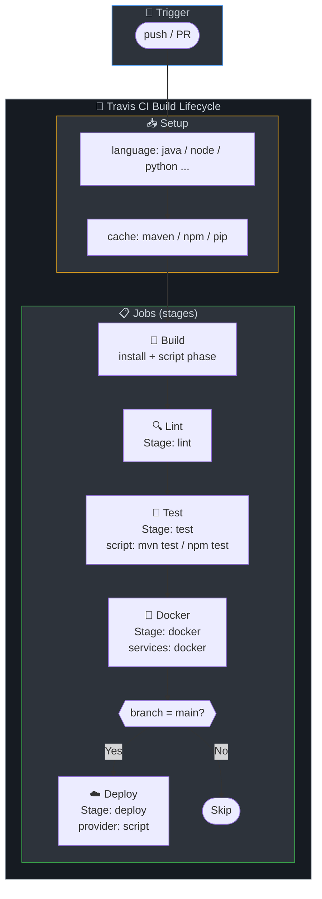

# 🔄 Travis CI Pipelines

Travis CI configurations for 8 tech stacks.

## Prerequisites

- Travis CI account connected to GitHub
- Repository enabled in Travis CI settings
- Environment variables: `DOCKER_USERNAME`, `DOCKER_PASSWORD`

## Pipeline Structure

Each `.travis.yml` uses Travis stages with:
- **Stages**: build → lint → test → docker → deploy
- **Caching**: Maven, npm, pip, etc. for dependency speedup
- **Conditional jobs**: docker and deploy only on `main` branch

## CI/CD Pipeline Diagram

## Stage-by-Stage Explanation

| Stage | Purpose | What Happens | Artifacts / Output |
|-------|---------|--------------|--------------------|
| **build** | Compile or install deps | Maven compile/package, npm ci, pip install, etc. Caches deps. | JAR, build artifacts |
| **lint** | Static analysis | checkstyle, ESLint, flake8, go vet, etc. Fails on violations. | — |
| **test** | Unit tests | Runs tests. Some configs publish coverage. | — |
| **docker** | Containerize and push | Docker login, build, tag, push. Only on main. | Image in registry |
| **deploy** | Deploy to staging | Only on main. Replace echo with kubectl/Helm. | — |

## Tech Stacks

| Stack | File | Language / JDK | Lint Tool | Test Framework |
|-------|------|-----------------|-----------|----------------|
| Java | [java/.travis.yml](java/.travis.yml) | openjdk17 | Checkstyle | JUnit |
| Node.js | [nodejs/.travis.yml](nodejs/.travis.yml) | node_js 18 | ESLint | Jest/npm test |
| Python | [python/.travis.yml](python/.travis.yml) | python 3.12 | flake8 | pytest |
| Go | [go/.travis.yml](go/.travis.yml) | go 1.21 | go vet | go test |
| .NET | [dotnet/.travis.yml](dotnet/.travis.yml) | dotnet 8.0 | dotnet format | xUnit/NUnit |
| Ruby | [ruby/.travis.yml](ruby/.travis.yml) | ruby 3.3 | RuboCop | RSpec |
| Rust | [rust/.travis.yml](rust/.travis.yml) | rust stable | clippy, rustfmt | cargo test |
| PHP | [php/.travis.yml](php/.travis.yml) | php 8.2 | phpcs, phpstan | PHPUnit |

## Usage

1. Copy the desired `.travis.yml` to your project root
2. Enable the repo in Travis CI
3. Configure environment variables in Travis CI repo settings
4. Push to trigger

## Resources

- [Travis CI Documentation](https://docs.travis-ci.com/)
